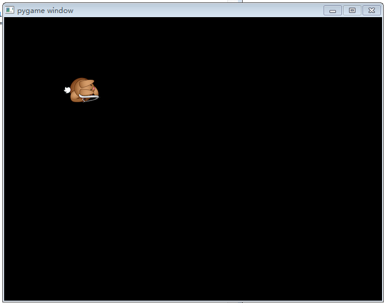
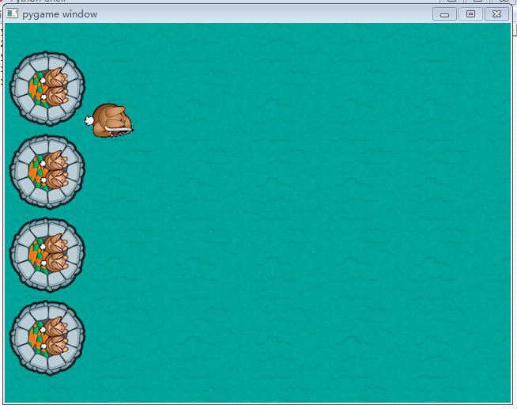
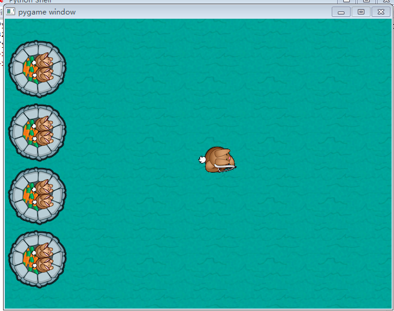
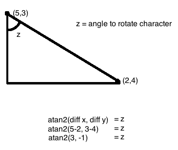
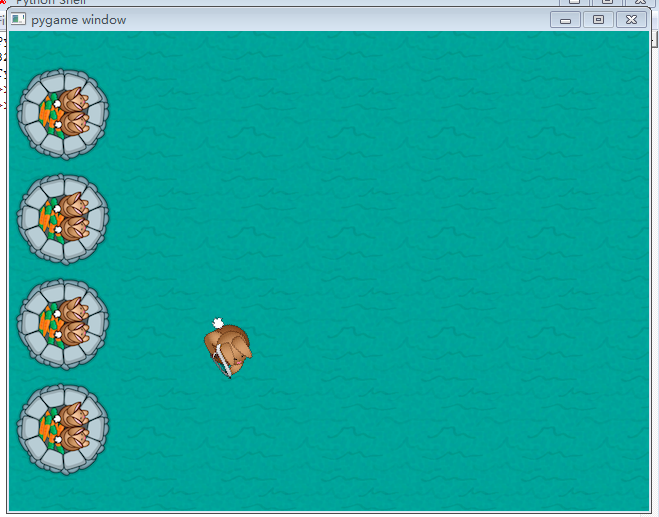
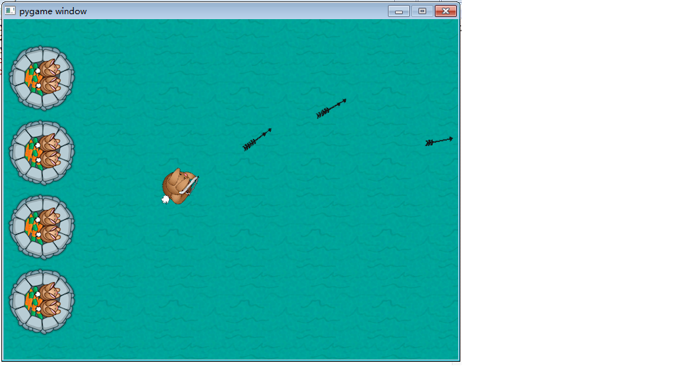
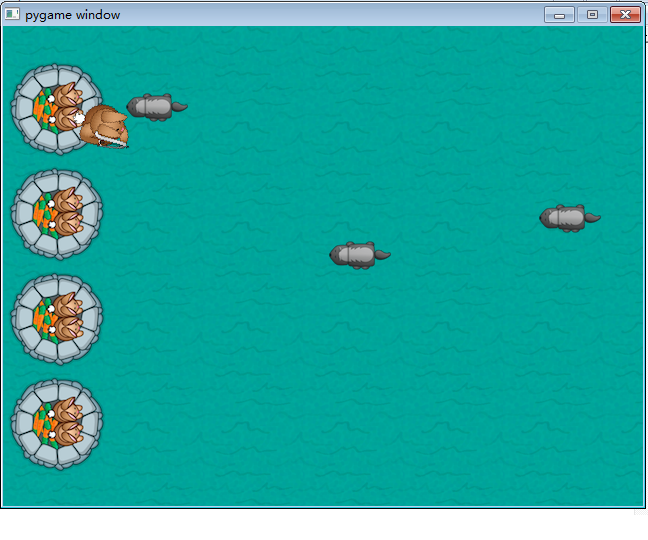
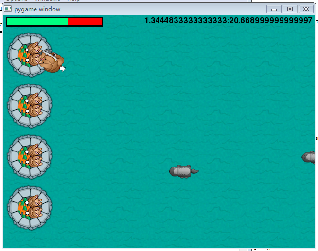
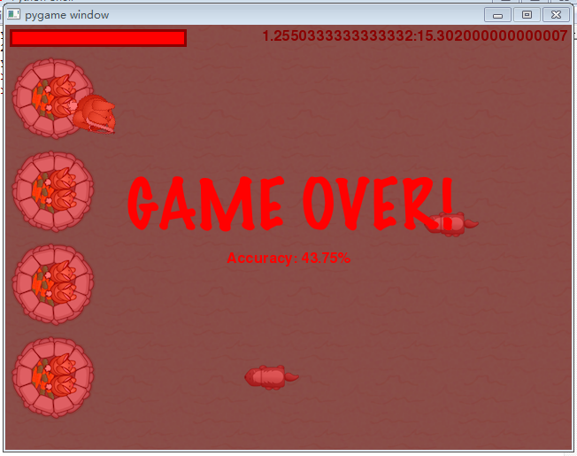

## 第一步：哈罗，兔子！

运行IDLE并且打开一个文本编辑窗口，输入以下代码：

```
# 1 - 导入pygame库
import pygame
from pygame.locals import *

# 2 - 初始化游戏
pygame.init()
width, height = 640, 480
screen=pygame.display.set_mode((width, height))

# 3 - 加载图像
player = pygame.image.load("resources/images/dude.png")

# 4 - 保持循环
while 1:
    # 5 - 在绘制图像之前先清除屏幕
    screen.fill(0)
    # 6 - 绘制屏幕上的部件
    screen.blit(player, (100,100))
    # 7 - 更新屏幕
    pygame.display.flip()
    # 8 - 在事件之间循环
    for event in pygame.event.get():
        # 检查是不是关闭按钮按下 
        if event.type==pygame.QUIT:
            # 如果是，退出游戏
            pygame.quit() 
            exit(0)
```

在你的游戏文件夹中保存这个文件，文件名为game.py。

让我们分析这段代码：

1. 导入PyGame库，导入后我们才可以在后面的程序用使用这个库的功能。

2. 初始化游戏，设置游戏窗口的尺寸。

3. 加载兔子图像。

4. 在缩进代码中保持循环。

   > 注意：其他编程语言像java、C或PHP，使用括号来标识一段循环或条件判断中的代码块，Python使用缩进来标明代码块。所以正确的缩进非常重要，一定要记住。

5. 在绘制图像之前用黑色填充屏幕。

6. 在x=100，y=100位置显示兔子。

7. 更新屏幕。

8. 检查事件， 如果事件是退出命令，退出程序。

如果你现在运行程序，你会看到下面的屏幕：



兔子准备好了，随时准备攻击！但是黑色屏幕上一只孤零零的兔子，看起来很可怜。让我们在增加一点东西。

## 第二步：添加舞台布景

我们先为游戏增加背景。通过调用`screen.blit()`可以做到。

在#3末尾，加载图像之后，增加下面的代码：

```python
grass = pygame.image.load("resources/images/grass.png")
castle = pygame.image.load("resources/images/castle.png")
```

这段代码加载草地和兔子堡垒的图像，然后存储到变量中。现在应该把它们绘制到屏幕上。但现在如果你检查草地图像，会发现它没有覆盖整个屏幕（屏幕尺寸设置为640x480）。这意味着你不得不把草地图片铺满整个屏幕。

在#6下面增加以下代码（在绘制玩家之前）：

```
 for x in range(int(width/grass.get_width())+1):
     for y in range(int(height/grass.get_height())+1):
         screen.blit(grass,(x*100,y*100))
screen.blit(castle,(0,30))
screen.blit(castle,(0,135))
screen.blit(castle,(0,240))
screen.blit(castle,(0,345 ))
```

像你看到的那样，`for`首先循环`x`次，然后在这个循环里，它又循环`y`次，绘制草地图像。下面的几段代码在屏幕上绘制四个兔子堡垒。

如果你现在运行程序，看上去应该像这样：



看起来好多了吧？

## 第三步：让兔子动起来

接下来，您需要添加一些实际的游戏元素，例如让兔子响应按键。

要做到这一点，首先你会实现一个很好的方法，用来跟踪在给定的时刻哪些键按下了。 你可以简单地做一个关键状态的数组，来保存每个要用于游戏的键的状态。

在第#2节末尾添加以下代码到game.py（设置屏幕高度和宽度后）：

```

keys = [False, False, False, False]
playerpos=[100,100]
```

这段代码非常简单。 按键数组按照以下顺序跟踪被按下的键：WASD。数组中的每个项目对应一个键 - 第一个为W，第二个为A，等等。

playerpos变量是程序绘制游戏玩家的位置。由于游戏会将玩家移动到不同的位置，所以设置一个包含玩家位置的变量，然后简单地在不同位置绘制这个变量。

现在您需要修改现有的代码来绘制玩家以使用新的playerpos变量。 更改第6节中的以下行：

```

screen.blit(player, (100,100))
```

更改为：

```

screen.blit(player, playerpos)
```

接下来，根据按下哪个键更新键数组。PyGame通过添加event.key功能使检测按键更容易。

在＃8的末尾，在检查`event.type == pygame.QUIT`之后，增加以下代码（与pygame.QUIT相同的缩进级别）：

```
if event.type == pygame.KEYDOWN:
    if event.key==K_w:
        keys[0]=True
    elif event.key==K_a:
        keys[1]=True
    elif event.key==K_s:
        keys[2]=True
    elif event.key==K_d:
        keys[3]=True
if event.type == pygame.KEYUP:
    if event.key==pygame.K_w:
        keys[0]=False
    elif event.key==pygame.K_a:
        keys[1]=False
    elif event.key==pygame.K_s:
        keys[2]=False
    elif event.key==pygame.K_d:
        keys[3]=False
```

哇！很多代码行!其实如果你把它分解成if语句，并不是那么复杂。

首先，您检查一下按键是否被按下或释放。 然后您检查按下或释放了哪个键，如果按下或释放的键是您正在使用的键之一，则相应地更新键变量。

最后，您需要根据按键更新playerpos变量。 这其实很简单。

将以下代码添加到game.py的末尾（一个缩进，将其放在与for循环相同的级别）：

```

# 9 - Move player
if keys[0]:
    playerpos[1]-=5
elif keys[2]:
    playerpos[1]+=5
if keys[1]:
    playerpos[0]-=5
elif keys[3]:
    playerpos[0]+=5
```

该代码简单地检查按下哪个键，并从兔子的x或y位置添加或减去（取决于按下的键）5来移动玩家。

运行游戏，你应该像以前一样得到一个兔子。尝试按WASD。 好极了！ 对吧？



## 第四步：旋转玩家

是的，当你按键你的兔子现在会移动，如果你可以使用鼠标旋转兔子面对你选择的方向，那就更酷了，所以它不就不会一直朝向同一个方向了？使用三角函数可以很容易地实现。

看下图：



在上述图像中，如果（5,3）是兔子的位置，(2,4）是鼠标的当前位置，则可以通过将atan2三角函数应用于差两点之间的距离来找到旋转角度（z）。当然，一旦你知道旋转角度，你可以简单地旋转兔子。 ：]

如果你对这部分有些困惑，别担心 —— 你可以继续下去。但这就是为什么你应该在数学课上注意！ ：]你会一直在游戏编程中使用这些东西。

现在你需要把这个概念应用到你的游戏中。 为此，您可以使用PyGame `Surface.rotate`（度）函数。 顺便说一句，请记住，Z值是弧度。 ：[

`atan2`函数来自Python数学库。 所以首先添加到第1节的末尾：

```

import math
```

然后，用以下代码替换#6中的最后一行（player.blit）:

```

# 6.1 - Set player position and rotation
position = pygame.mouse.get_pos()
angle = math.atan2(position[1]-(playerpos[1]+32),position[0]-(playerpos[0]+26))
playerrot = pygame.transform.rotate(player, 360-angle*57.29)
playerpos1 = (playerpos[0]-playerrot.get_rect().width/2, playerpos[1]-playerrot.get_rect().height/2)
screen.blit(playerrot, playerpos1)
```

我们来看一下上述代码的基本结构。首先你会得到鼠标和兔子的位置。然后你把这些输入atan2功能。之后，您将从atan2功能接收到的角度从弧度转换为度数（乘以弧度大约为57.29或360/2π）。

由于兔子会旋转，它的位置会改变。所以现在你计算出新的兔子的位置，并在屏幕上显示兔子。

再次运行游戏。如果您只使用WASD键，那么游戏应该像以前一样。但如果你移动鼠标，兔子也会旋转。酷！



## 第五步：射击，兔子，射击！

现在你的兔子移动了，现在是添加一点点动作的时候了。 ：] 如何让兔子用箭射杀入侵的敌人？这不是一只温和的兔子！

这个步骤有点复杂，因为你必须跟踪所有的箭，更新它们，旋转它们，并在屏幕外删除它们。

首先，将必要的变量添加到#2初始化部分的末尾：

```

acc=[0,0]
arrows=[]
```

第一个变量跟踪播放器的准确度，第二个数组跟踪所有的箭。精确度变量（acc）本质上是发射射击次数和击中獾数量的数组。之后，我们将使用这些信息来计算准确率。

接下来，在第#3节末尾的加载箭头图像：

```

arrow = pygame.image.load("resources/images/bullet.png")
```

现在当用户点击鼠标时，需要发射箭头。将以下内容添加到第#8节末尾作为新的事件处理程序：

```

if event.type==pygame.MOUSEBUTTONDOWN:
    position=pygame.mouse.get_pos()
    acc[1]+=1
    arrows.append([math.atan2(position[1]-(playerpos1[1]+32),position[0]-(playerpos1[0]+26)),playerpos1[0]+32,playerpos1[1]+32])
```

该代码检查鼠标是否被点击，如果是，它会获取鼠标位置，并根据旋转的兔子位置和鼠标位置计算箭头旋转。 该旋转值存储在箭头数组中。

接下来，你必须在画面上画箭头。在第6.1节之后添加以下代码：

```

# 6.2 - Draw arrows
for bullet in arrows:
    index=0
    velx=math.cos(bullet[0])*10
    vely=math.sin(bullet[0])*10
    bullet[1]+=velx
    bullet[2]+=vely
    if bullet[1]<-64 or bullet[1]>640 or bullet[2]<-64 or bullet[2]>480:
        arrows.pop(index)
    index+=1
    for projectile in arrows:
        arrow1 = pygame.transform.rotate(arrow, 360-projectile[0]*57.29)
        screen.blit(arrow1, (projectile[1], projectile[2]))
```

使用基本三角法计算vely和velx值。10是箭头的速度。if语句只是检查箭头是否超出范围，如果是，它会删除箭头。第二个语句循环所有的箭头，并以正确的旋转绘制它们。

尝试并运行该程序。你应该有一个兔子，当你点击鼠标时它会射出箭！ ：D



## 第六步：拿起武器！獾！

好的，你有一座城堡，你有一个可以移动和射击的英雄。那么少了什么？攻击英雄防护的城堡的敌人！


在此步骤中，您将创建随机生成的向城堡进攻的。游戏进行中，会有越来越多的獾。所以，让我们列出你需要做什么。

1. 将坏人添加到列表中。
2. 更新每个帧中的坏家伙数组，并检查他们是否走到屏幕以外。
3. 显示坏人。

轻松吧？ ：]

首先，将以下代码添加到第#2节的末尾：

```

badtimer=100
badtimer1=0
badguys=[[640,100]]
healthvalue=194
```

以上设置了一个计时器（以及一些其他值），以便游戏在运行一段时间后添加新的獾。你在每一帧不断减少badtimer数值，直到它为零，然后产生一个新的獾。

现在将以下内容添加到第#3节的末尾：

```

badguyimg1 = pygame.image.load("resources/images/badguy.png")
badguyimg=badguyimg1
```

上面的第一行类似于所有以前的图像加载代码。第二行设置图像的副本，以便您可以更轻松地为坏人制作动画。

接下来，你必须更新并显示坏人。在第#6.2节之后添加此代码：

```

# 6.3 - Draw badgers
if badtimer==0:
    badguys.append([640, random.randint(50,430)])
    badtimer=100-(badtimer1*2)
    if badtimer1>=35:
        badtimer1=35
    else:
        badtimer1+=5
index=0
for badguy in badguys:
    if badguy[0]<-64:
        badguys.pop(index)
    badguy[0]-=7
    index+=1
for badguy in badguys:
    screen.blit(badguyimg, badguy)
```

许多代码。：] 第一行检查badtimer是否为零，如果是，创建一个獾，并根据到目前为止运行badtimer多少次，再次设置badtimer。第一个for循环更新獾的x位置，检查獾是否离开屏幕，并且如果在屏幕外，则会删除獾。第二个循环绘制所有的獾。

为了在上面的代码中使用随机函数，你还需要导入随机库。因此，将以下内容添加到第#1节的末尾：

```

import random
```

最后，在while语句（第#4节）之后添加这一行，以减少每一帧的badtimer的值：

```

badtimer-=1
```

通过运行游戏来尝试所有这些代码。现在你应该开始看到真正的游戏 —— 你可以射击，移动，转身和獾们试图跑到你身边。



可是等等！ 为什么獾们扑向城堡？让我们快点添加一下…

在第#6.3节第一个for循环的`index+=1`之前添加此代码：

```

# 6.3.1 - Attack castle
badrect=pygame.Rect(badguyimg.get_rect())
badrect.top=badguy[1]
badrect.left=badguy[0]
if badrect.left<64:
    healthvalue -= random.randint(5,20)
    badguys.pop(index)
# 6.3.3 - Next bad guy
```

这段代码很简单。如果獾的x值小于64，则删除该坏人，并将游戏健康值降低5到20之间的随机值（稍后将显示当前的健康值）。

如果你建立和运行程序，你应该得到一堆攻击的獾，当他们击中城堡时消失。 虽然你看不到，但是獾们实际上z在降低你的健康值。

## 第七步：獾与箭的碰撞

獾们攻击你的城堡，但你的箭对他们没有影响！兔子应该如何保卫自己的家？

是时候设置箭头杀死獾了，然后你可以保护城堡，赢得比赛！基本上，你必须在每一个循环里循环遍历所有的坏家伙，循环遍历所有的箭头，并检查它们是否碰撞。如果他们碰撞了，那么删除獾，删除箭头，并将你的准确率加一。

在第#6.3.1节之后，添加：

```

#6.3.2 - Check for collisions
index1=0
for bullet in arrows:
    bullrect=pygame.Rect(arrow.get_rect())
    bullrect.left=bullet[1]
    bullrect.top=bullet[2]
    if badrect.colliderect(bullrect):
        acc[0]+=1
        badguys.pop(index)
        arrows.pop(index1)
    index1+=1
```

在这段代码中只需要注意一点。if语句中是一个内置的PyGame函数，用于检查两个矩形是否相交。其他几行代码我上面已经解释过。

现在如果你运行这个程序，你应该能够射击和杀死獾。

## 第八步：添加健康计时器和时钟

游戏进度相当不错。你有你的攻击者，你有你的防守者。现在你需要的只是一种累计分数并显示兔子做得很好的方法。

最简单的方法是添加一个显示城堡当前运行状况的HUD（头像显示）。您还可以添加时钟来显示城堡已经存活多久。

先添加时钟。 在＃7开头之前添加以下代码：

```

# 6.4 - Draw clock
font = pygame.font.Font(None, 24)
survivedtext = font.render(str((90000-pygame.time.get_ticks())/60000)+":"+str((90000-pygame.time.get_ticks())/1000%60).zfill(2), True, (0,0,0))
textRect = survivedtext.get_rect()
textRect.topright=[635,5]
screen.blit(survivedtext, textRect)
```

上述代码使用默认的PyGame字体设置创建一个新的字体，字体大小为24。然后使用该字体将时间的文本渲染到屏幕上。之后，文本在屏幕上定位和绘制。

接下来添加健康栏。但在绘制健康条之前，您需要加载条形图像。将以下代码添加到第#3节的末尾：

```

healthbar = pygame.image.load("resources/images/healthbar.png")
health = pygame.image.load("resources/images/health.png")
```

第一个是用于完整健康值的红色图像。第二个是用于显示当前健康水平的绿色图像。

现在在第#6.4节（您刚添加的）之后添加以下代码，以在屏幕上绘制健康条：

```

# 6.5 - Draw health bar
screen.blit(healthbar, (5,5))
for health1 in range(healthvalue):
    screen.blit(health, (health1+8,8))
```

代码首先绘制全红的健康栏。然后，根据城堡剩余的生命，它在健康栏上画一定数量的绿色。

如果你建立并运行程序，你应该有一个计时器和一个健康条了。



## 第九步：胜利或失败

但是怎么回事？如果你玩得时间足够长，即使你的健康状况下降到零，游戏还会继续下去！不仅如此，你也可以继续在獾们身上射击。那不行，现在呢？你需要一些胜利/失败的场景，使游戏值得玩。

所以让我们添加胜利与失败的条件以及显示赢或输结果的屏幕。 ：] 你通过退出主循环进入一个赢/输循环实现。 在赢/输循环中，您必须弄清楚用户是赢还是输，并相应地显示屏幕。

这是一个基本的失败场景：

如果时间到了（90000毫秒或90秒），那么：

- 停止运行游戏
- 将比赛的结果设为1或赢

如果城堡被毁了，那么：

- 停止运行游戏
- 将比赛的结果设为1或赢

以任一方式计算准确度。

> 注意：`acc[0]*1.0`只是将`acc[0]`转换成float。如果不这样做，则除法操作数将返回像1或2这样的整数，而不是1.5。

在game.py末尾添加以下代码：

```

    #10 - 输赢检查
    if pygame.time.get_ticks()>=90000:
        running=0
        exitcode=1
    if healthvalue<=0:
        running=0
        exitcode=0
    if acc[1]!=0:
        accuracy=acc[0]*1.0/acc[1]*100
    else:
        accuracy=0
# 11 - 显示输赢        
if exitcode==0:
    pygame.font.init()
    font = pygame.font.Font(None, 24)
    text = font.render("Accuracy: "+str(accuracy)+"%", True, (255,0,0))
    textRect = text.get_rect()
    textRect.centerx = screen.get_rect().centerx
    textRect.centery = screen.get_rect().centery+24
    screen.blit(gameover, (0,0))
    screen.blit(text, textRect)
else:
    pygame.font.init()
    font = pygame.font.Font(None, 24)
    text = font.render("Accuracy: "+str(accuracy)+"%", True, (0,255,0))
    textRect = text.get_rect()
    textRect.centerx = screen.get_rect().centerx
    textRect.centery = screen.get_rect().centery+24
    screen.blit(youwin, (0,0))
    screen.blit(text, textRect)
while 1:
    for event in pygame.event.get():
        if event.type == pygame.QUIT:
            pygame.quit()
            exit(0)
    pygame.display.flip()
```

这是最长的代码了！但并不复杂。

第一个if语句检查时间是否满足。第二个检查城堡是否被毁坏。第三个计算您的准确率。之后，if语句检查您是否赢了或失败并显示对应的图像。

当然，如果要显示失败或胜利的图像，则必须首先加载这些图像。 因此，将以下代码添加到第#3节的末尾：

```

gameover = pygame.image.load("resources/images/gameover.png")
youwin = pygame.image.load("resources/images/youwin.png")
```

还有一件简单的工作，把#4从：

```

# 4 - 保持循环
while 1:
    badtimer-=1
```

修改为：

```

# 4 - 保持循环
running = 1
exitcode = 0
while running:
    badtimer-=1
```

运行变量跟踪游戏是否结束，退出代码变量跟踪玩家是赢或输。

再次运行游戏，现在你可以胜利或死亡！ ：]



## 第十步：音乐和声音效果！

游戏看起来很不错，但是怎么回事？有点安静，不是吗？添加一些音效可以改变游戏的感觉。

PyGame使加载和播放声音超级简单。首先，您必须在第#2节末尾加入调音台：

```

pygame.mixer.init()
```

然后在#3末尾加载声音，设置音量：

```

# 3.1 - 加载音频
hit = pygame.mixer.Sound("resources/audio/explode.wav")
enemy = pygame.mixer.Sound("resources/audio/enemy.wav")
shoot = pygame.mixer.Sound("resources/audio/shoot.wav")
hit.set_volume(0.05)
enemy.set_volume(0.05)
shoot.set_volume(0.05)
pygame.mixer.music.load('resources/audio/moonlight.wav')
pygame.mixer.music.play(-1, 0.0)
pygame.mixer.music.set_volume(0.25)
```

以上代码大部分仅仅是加载音频文件并配置音频音量级别。但是请注意`pygame.mixer.music.load`行 —— 该行加载游戏的背景音乐，下一行将背景音乐设置为重复。

还需要处理音频配置。 ：] 现在你需要做的就是根据需要播放各种音效。按照以下代码的注释中的说明进行操作：

```

# 6.3.1 if badrect.left<64 之后:
hit.play()
# 6.3.2 if badrect.colliderect(bullrect) 之后:
enemy.play()
# 8, if event.type==pygame.MOUSEBUTTONDOWN 之后:
shoot.play()
```

再次运行游戏，你会注意到，你现在有了背景音乐和射击的音效。 游戏感觉更棒！ ：]